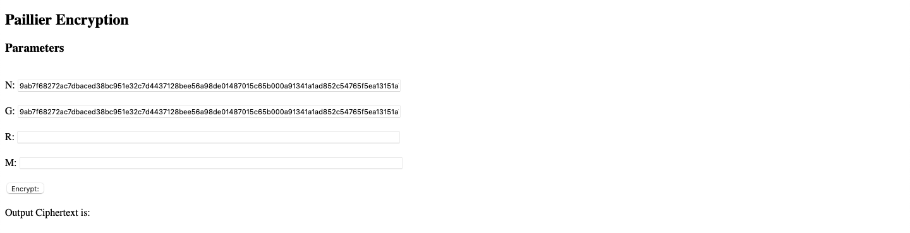
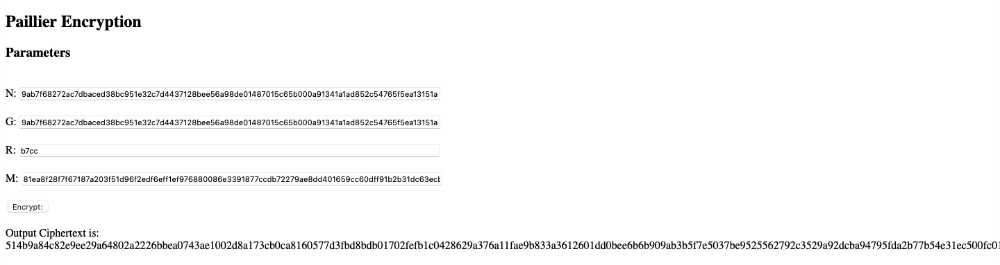

# INTE2401-Paillier

Cloud Security, Assignment 3, Question 1

Author: Daniel Viglietti s3844180

Date: 13/05/2022

JavaScript Web Interface for Paillier Encryption Algorithm

Dependencies: BigInteger.js library

This is the basic interface, for my sake the public key (n, g) is pre-filled, but can easily be replaced with your values.

Once the random value (r) and message (m) are entered, press encrypt and it'll encrypt the message and return the ciphertext.

It should be noted, that this is designed to work with bigInt hex values.